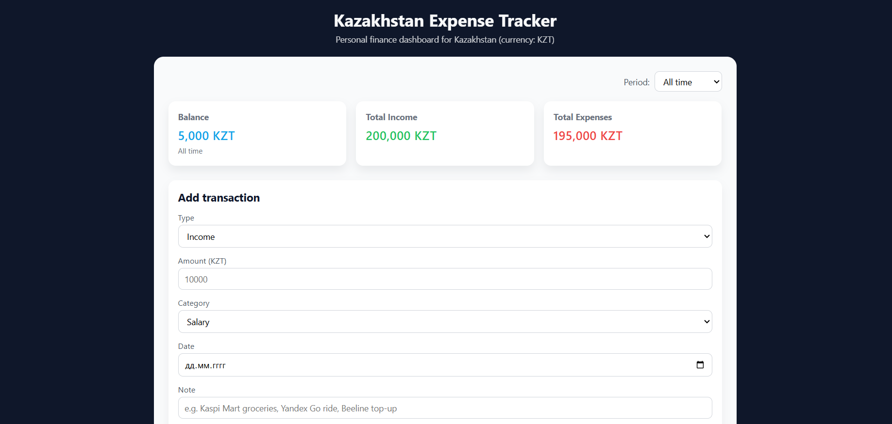

# Kazakhstan Expense Tracker (KZT)

Personal finance dashboard for Kazakhstan. Track income and expenses in KZT with local categories (Kaspi QR, installments, utilities, mobile operators, transport, etc.) and see a monthly summary with a pie chart.

## Tech stack

- HTML5
- CSS3
- Vanilla JavaScript (ES6)
- Chart.js (via CDN)
- LocalStorage (browser)

## Features

- Add income and expense transactions with:
  - Type, amount, category, date and note
  - Kazakhstan-specific categories (Kaspi QR & in-store purchases, Kaspi installment, groceries, utilities, public transport & taxis, internet & mobile operators, rent, education, health, entertainment, etc.)
- Live summary cards:
  - Balance, total income, total expenses
- Period filter:
  - `This month` vs `All time` — affects table, summary and chart
- Data persistence:
  - Transactions stored in browser LocalStorage
- Visualization:
  - Pie chart of expenses by category using Chart.js

## How to run locally

1. Clone the repository:

```
git clone https://github.com/BadMeats2001/kz-expense-tracker.git
```
```
cd kz-expense-tracker
```

2. Open `index.html` in a modern browser (Chrome, Edge, Firefox).  
3. Start adding transactions and explore the dashboard.

## Screenshots



## Possible future improvements

- Multi-currency support (KZT + USD/EUR with live rates)
- Export transactions to CSV
- Simple authentication and cloud sync
- Mobile-friendly navigation for PWA / mobile apps
